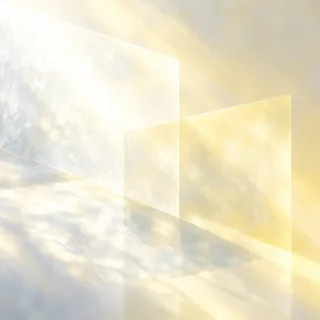
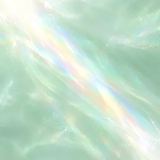

# 今日意象：七類圖片預覽

七張固定類別意象已放在 `public/images/categories/`。下表是圖片本身；介面會依當天片段狀態裁成圓形顯示。未出現的類別只顯示對應色調的空輪廓。

| 類別 | 預覽 | 色調 |
| --- | --- | --- |
| 人物 |  | 煙灰藍 `#B7C7D9` |
| 服裝 |  | 淡粉 `#E8CBD8` |
| 背景 |  | 冰青 `#B8DCE3` |
| 氛圍 |  | 淡紫 `#D4C7E8` |
| 構圖 |  | 奶油黃 `#EADFAE` |
| 色調 |  | 薄荷綠 `#C8DEC7` |
| 姿勢 |  | 暖杏橘 `#EBC5A9` |

共同生成提示：Square edge-to-edge miniature image for circular CSS crop; dreamy soft photographic illustration, translucent glass and gentle watercolor diffusion, pearl-white upper-left light, delicate grain, low contrast, one restrained pastel hue, simple central subject readable at 56 px; no text, logo, UI or drawn circular border. 各類另加上表所列的色調與畫面線索。素材由內建 image_gen 逐張生成，縮至 320 × 320 並轉成 WebP 供網頁使用。
